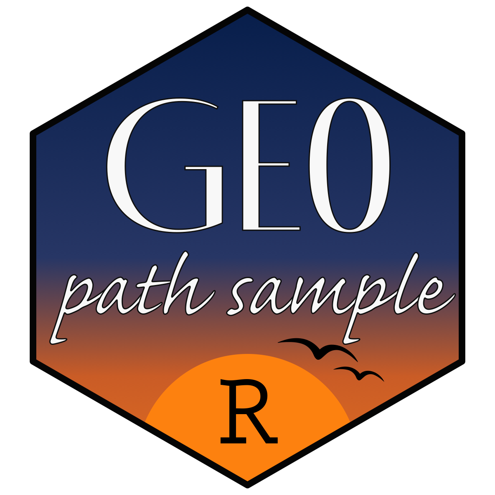

<!-- README.md is generated from README.Rmd. Please edit this file. -->

```{r, include = FALSE}
knitr::opts_chunk$set(collapse = TRUE, comment = "#>")
```

# GeoPathSampleR 

<!-- badges: start -->
[](https://github.com/GeoPressure/GeoPathSampleR/actions/workflows/R-CMD-check.yaml)
[](https://github.com/GeoPressure/GeoPathSampleR/actions/workflows/pkgdown.yaml)
[](https://app.codecov.io/gh/GeoPressure/GeoPathSampleR)
<!-- badges: end -->

GeoPathSampleR reconstructs stationary animal trajectories from geolocation likelihood maps. It provides a Gibbs sampler, reusable prepared inputs, posterior stay summaries, and diagnostics for GeoPressureR tag objects.

## Installation

```r
# install.packages("pak")
pak::pkg_install("GeoPressure/GeoPathSampleR")
```

## Core workflow

Prepare a GeoPressureR tag with a likelihood map, then sample paths:

```r
library(GeoPathSampleR)

paths <- sampling_path(tag, iter = 1000, chains = 4, seed = 1)
diagnostic <- sampling_path_diagnostic(paths, tag, report = FALSE)
consensus <- path_summary(paths, tag$stap, by = "consensus_stay")
```

See the [getting-started vignette](https://geopressure.org/GeoPathSampleR/articles/getting-started.html)
for inputs, movement settings, and interpretation.
