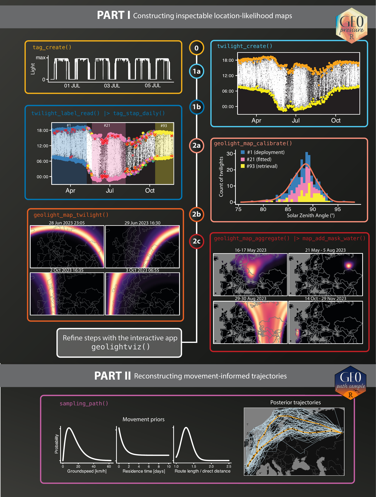

This vignette uses a light-only example tag bundled with GeoPathSampleR. It shows the complete workflow from raw geolocator data to sampled paths. The example is intentionally short and uses coarse settings so that it can be run while learning the workflow; it is not intended as a scientific analysis.

Figure @fig-workflow provides an overview of the steps that follow. Steps 0--3 cover the preparation of the likelihood map of light implemented in GeoPressureR and which is more extensively documented in the [GeoPressureManual](https://geopressure.org/GeoPressureManual/). We focus the explanation around key difference and provides links to the relevant section at the start of each subsection. Step 4 covers the sampling of the movement-model implemented in GeoPathSampleR.

{#fig-workflow width="95%"}

## Getting ready

```{r}
#| label: setup
#| code-fold: true
#| code-summary: "Show setup code"

library(GeoPathSampleR)
library(GeoPressureR)

knitr::opts_knit$set(
  root.dir = system.file("extdata", package = "GeoPathSampleR")
)
```

### Set-up your project folder

We recommend using GeoPressureTemplate as the starting point for your analysis. It provides a folder structure where all files for the analysis have their standardized location. Check the instruction on the [dedicated GeoPressureManual chapter](https://geopressure.org/GeoPressureManual/geopressuretemplate-intro.html).

Here, we use the `14OI` example contained in the GeoPathSampleR package. The vignette working directory is set to the package's `extdata` folder, so GeoPressureR can use its standard relative paths.

### Reading the data

[Create a tag](https://geopressure.org/GeoPressureManual/tag-object.html#create-tag) reads the sensor files from `data/raw-tag/{id}`. The `14OI` example contains light data only, so `assert_pressure = FALSE` is required. Use `crop_start` and `crop_end` to define the period of the data when on the bird.

```{r}
tag <- tag_create(
  "14OI",
  crop_start = "2015-07-17",
  crop_end = "2016-07-11",
  assert_pressure = FALSE,
  quiet = TRUE
)
```

## Create and label twilights

[Estimating twilights](https://geopressure.org/GeoPressureManual/light-map.html#estimate-twilights) converts the light time series into sunrise and sunset observations.

```{r}
tag <- twilight_create(tag)
```

[Labelling twilights](https://geopressure.org/GeoPressureManual/light-map.html#manual-labelling-of-twilight) is done interactively with [geolightviz](https://geopressure.org/GeoPressureManual/geolightviz.html#label-twilight).

```{r}
#| eval: false
geolightviz(tag)
```

Once you have exported the label file to `data/twilight-label/{id}-labeled.csv`, read those labels with:

```{r}
tag <- twilight_label_read(tag)
plot(tag, type = "twilight")
```

### Define staps

Standard GeoPressureR workflows use acceleration and pressure data to identify flight and stationary periods. This light-only example cannot use those signals, so long stationary periods are identified visually from the twilight plot instead.

Define long stationary periods (`stap0`) manually with [geolightviz](https://geopressure.org/GeoPressureManual/geolightviz.html#define-stationary-periods) and save them in `data/stap-label/{id}.csv`. 
```{r}
#| eval: false
geolightviz(tag)
```

Unlike a standard GeoPressureR analysis, we create daily stationary periods during migration. `tag_stap_daily()` starts with the long stationary periods (`stap0`) and fills the gaps with daily periods, grouping twilights according to whether movement is assumed to occur during the night or the day.

```{r}
tag <- tag_stap_daily(
  tag,
  stap_long = tag$param$id,
  movement_period = "day",
  quiet = TRUE
)
```

### Define map

[Defining a map](https://geopressure.org/GeoPressureManual/pressure-map.html#define-geographical-and-temporal-parameters-of-the-map) sets the spatial extent and grid resolution used by the likelihood maps. This step comes after stationary periods have been defined because the map uses them as its temporal dimension. The example does not contain known coordinates, so calibration is fitted automatically from the long stationary periods.

```{r}
tag <- tag |>
  tag_set_map(
    extent = c(-20, 40, -11, 60),
    scale = 1
  )
```

::: {.callout-warning}

For this example, we assume that no known location is available. This should be rare in a real study, but it illustrates calibration from fitted locations. When known deployment or recovery coordinates are available, include them in `tag_set_map(known = ...)` instead.

:::

This is a good place to check the twilight labels and the long and daily stationary periods with `geolightviz`. You can re-export the labels as needed and rerun the previous steps. The likelihood map is computed in the next section.

```{r}
#| eval: false
geolightviz(tag)
```


## Build the light likelihood

[Constructing light likelihoods](https://geopressure.org/GeoPressureManual/light-map.html) uses the twilight observations and map definition to estimate a light likelihood for each stationary period.


```{r}
tag <- geolight_map(
  tag,
  twl_calib_adjust = 1,
  fitted_location_duration = 30,
  twl_llp = \(n) 1.5 * log(n) / n,
  quiet = TRUE
)
```


::: {.callout-info}

The arguments used here differ from the GeoPressureR defaults and follow the calibration described in the GeoTwilight analysis (see the relevant appendix):

- `fitted_location_duration = 30` uses long stationary periods, including the non-breeding location, as fitted calibration periods.
- `twl_calib_adjust = 1` is used instead of `1.4` because the fitted calibration periods represent a broader range of twilight errors. The influence is small, and values between 1 and 1.4 are reasonable alternatives.
- `twl_llp = \(n) 1.5 * log(n) / n` applies the calibrated pooling weight for workflows combining long and daily stationary periods. Do not transfer this value automatically to workflows with multiple stationary-period durations defined from acceleration data.

:::

### Add the water mask
For landbird, a water mask removes cells from the set of locations that can be sampled.

```{r}
tag$map_light <- map_add_mask_water(tag$map_light)

plot(tag, type = "map_light")
```


## Sampling trajectories

The movement model implemented in `sampling_path()` combines three sources of information to define the trajectory:
- The light likelihood describes where each stationary period could be located. 
- The movement model describes plausible speeds and the probability of departing after a given residence time. 
- The route-length prior provides information about the expected detour of long intervals between stationary periods.

### Defining parameters

The default movement model is a Gamma speed distribution combined with a residence-dependent probability of movement.

```{r}
movement <- list(
  method = "gamma",
  shape = 1.26,
  scale = 10.3,
  low_speed_fix = 0.001,
  zero_speed_ratio = 0,
  move_stay_parameters = list(
    p_0 = 0.607,
    p_inf = 0.137,
    tau = 0.932
  ),
  move_stay = function(t) 0.137 + (0.607 - 0.137) * exp(-t / 0.932)
)
plot_movement(movement)
```

The principal model controls are:

- `component_weights = c(light = 1, movement = 1, route = 1)` balances the light, movement, and route components. Only relative values matter. Setting a weight to zero removes that component's soft contribution and should be used only for an explicit sensitivity analysis.
- `route_detour = 1` retains the empirical excess route-distance prediction. Values below one favour more direct routes; values above one favour more detoured routes.
- `long_period_light_only = TRUE` samples unknown long-period locations from their light likelihood without allowing the daily movement model to update them. This is useful when movement should not pull a long-period location toward another known or well-supported location.

The sampler uses Gibbs updates: it repeatedly updates one stationary-period location, or a block of locations, conditional on the current values of the other periods. The resulting draws are correlated, so the run must be long enough to explore the posterior and must be checked with multiple independent chains.

The following arguments control computation and diagnostics rather than the scientific model:

| Argument | Role and practical choice |
|---|---|
| `iter` | Number of saved iterations per chain after warmup. Increase it when effective sample sizes are too small. |
| `chains` | Number of independent chains. Use at least four for final inference. |
| `warmup` | Initial iterations discarded while the chain reaches its typical posterior region. |
| `thin` | Saving interval. Keep `1` unless storage is limiting; thinning does not improve mixing. |
| `block_interval` | Frequency of block updates. Keep the default unless explicitly comparing sampler efficiency. |
| `thr_likelihood` | Retained light-likelihood mass used to reduce the state space. The conservative default `0.99` is appropriate for final inference. |
| `thr_gs` | Maximum ground speed in km/h defining hard movement support. Use a biologically credible value. |
| `workers` | Number of parallel workers for independent chains. Use `1` while debugging and increase only when appropriate for the system. |
| `seed` | Random-number seed for reproducible chains. |


### First run

Begin with a short run to verify that the likelihood, movement support, and route prior are compatible. This run is for checking the workflow, not for inference.

```{r}
paths <- sampling_path(
  tag,
  iter = 500,
  chains = 4,
  warmup = 100,
  seed = 1,
  quiet = TRUE
)
```


### Diagnose the sampler

Always inspect convergence and computational-support diagnostics before interpreting a trajectory. The interactive report provides an overview of sampled paths, traces, R-hat, effective sample sizes, chain separation, and warnings about likelihood or movement boundaries.

For interactive review, generate the report with:

An example of the resulting report is available on the [diagnostic example page](https://geopressure.org/GeoPathSampleR/sampling-path-diagnostic.html).

```{r}
#| eval: false
diagnostic <- sampling_path_diagnostic(paths, tag, report = TRUE)
```

```{r}
#| eval: false
paths <- sampling_path(
  tag,
  iter = 1000,
  chains = 4,
  warmup = 500,
  seed = 1,
  quiet = TRUE
)
sampling_path_diagnostic(paths, tag, report = FALSE)
```

### Summarise posterior trajectories

`path_collapse()` retains a stay summary for every sampled path. `path_summary()` returns either one posterior summary per stationary period or one posterior consensus trajectory by first deriving the modal stay/move structure. The consensus is useful for a compact summary, but it does not replace uncertainty assessment.

```{r}
collapsed <- path_collapse(paths, tag$stap)
consensus <- path_summary(paths, tag$stap, by = "consensus_stay")
```

To show both the central trajectory and posterior variability, we draw ten paths at random, calculate the posterior mean position for each stationary period with `path_summary()`, and overlay the consensus path. The random draws are deliberately shown as thin grey lines; the mean and consensus should remain visually prominent.

```{r}
#| code-fold: true
#| code-summary: "Show plotting code"
#| label: fig-path-summaries
#| fig-cap: "Posterior trajectory summaries. Thin grey lines show ten randomly selected collapsed posterior draws. The green dashed line connects posterior mean positions for each stationary period, while the orange line shows the consensus stay/move path. The three summaries answer different questions and should not be interpreted as interchangeable estimates."

set.seed(1)
path_ids <- unique(paths[c("chain", "j")])
path_ids <- path_ids[
  sample.int(nrow(path_ids), size = min(10, nrow(path_ids))),
  ,
  drop = FALSE
]
draws <- paths[
  interaction(paths$chain, paths$j) %in%
    interaction(path_ids$chain, path_ids$j),
  ,
  drop = FALSE
]
draws <- path_collapse(draws, tag$stap)
draws$j <- interaction(draws$chain, draws$j, drop = TRUE)

mean_path <- path_summary(
  paths,
  tag$stap,
  by = "stap",
  position = "mean"
)

map_extent <- tag$param$tag_set_map$extent
map <- leaflet::leaflet(
  height = 700,
  options = leaflet::leafletOptions(zoomControl = TRUE)
) |>
  leaflet::addProviderTiles("Esri.WorldTopoMap") |>
  leaflet::fitBounds(
    lng1 = map_extent[1],
    lat1 = map_extent[3],
    lng2 = map_extent[2],
    lat2 = map_extent[4]
  )

map <- GeoPressureR::plot_path(
  draws,
  map = map,
  group = "Posterior draws",
  polyline = list(color = "#8C8C8C", weight = 2, opacity = 0.45),
  circle = list(radius = 1, stroke = FALSE, fillOpacity = 0)
)
mean_path$j <- 1
map <- GeoPressureR::plot_path(
  mean_path,
  map = map,
  group = "Posterior mean",
  polyline = list(
    color = "#2E8B57",
    weight = 4,
    opacity = 1,
    dashArray = "8, 6"
  ),
  circle = list(radius = 1, stroke = FALSE, fillOpacity = 0)
)
consensus$j <- 1
GeoPressureR::plot_path(
  consensus,
  map = map,
  group = "Consensus",
  polyline = list(color = "#C26D22", weight = 5, opacity = 1),
  circle = list(radius = 1, stroke = FALSE, fillOpacity = 0)
) |>
  leaflet::addLayersControl(
    overlayGroups = c("Posterior draws", "Posterior mean", "Consensus"),
    options = leaflet::layersControlOptions(collapsed = TRUE)
  )
```

The posterior mean is not necessarily a valid sampled trajectory: averaging locations can place a point between two distinct posterior modes. The consensus path preserves a representative stay/move structure, while the individual draws make multimodality and route uncertainty visible.
